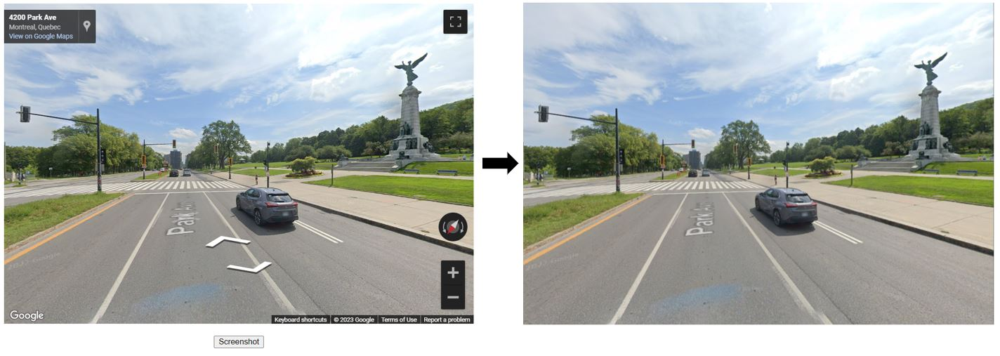
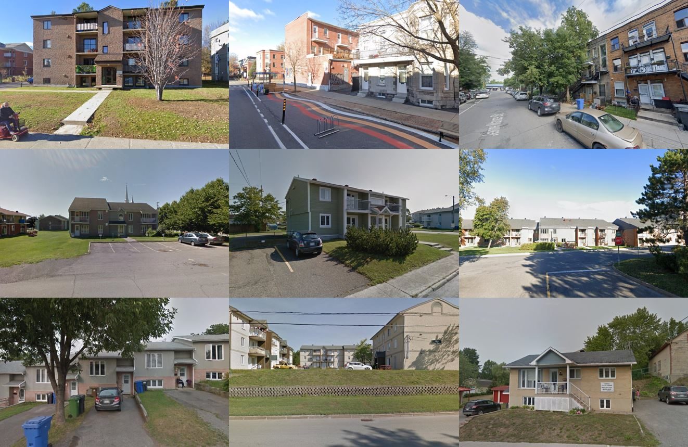

# Take screenshots of an embedded Google Street View container

Proof of concept showing how to take cleaned up, arbitrary sized screenshots of an embedded Streetview using [`html2canvas.js`](https://html2canvas.hertzen.com/) and the [Google Maps JS API Street View Service](https://developers.google.com/maps/documentation/javascript/streetview).

## Example results

## Notes

- The street name labels are not removed
- This requires a [Maps API key](https://developers.google.com/maps/documentation/javascript/cloud-setup) (there's a $200/month free credit)
- Replace `YOUR_API_KEY` in `index.html` with your key :) 
- To start somewhere else, replace the `lat` and `lng` coordinates in `maps.js::initMap()`